# Intro to SQL

- SQL is a relational database language. It consists of tables and arow that can be searched using commands and conditiopns such as SELECT, FROM, ORDER BY and LIMIT/OFFSET.

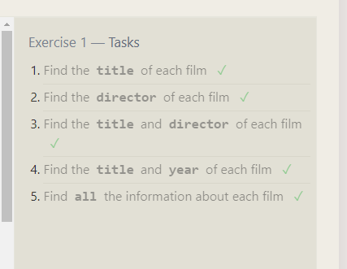
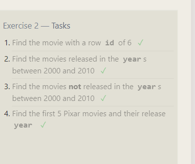
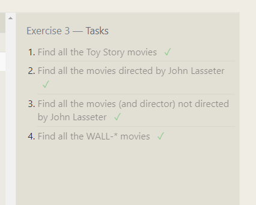
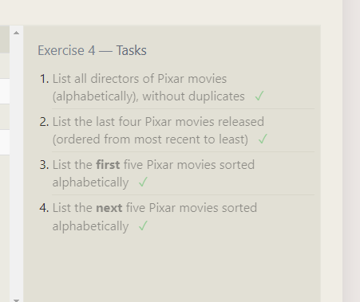
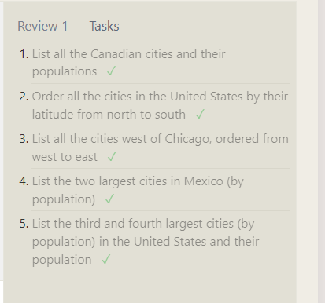
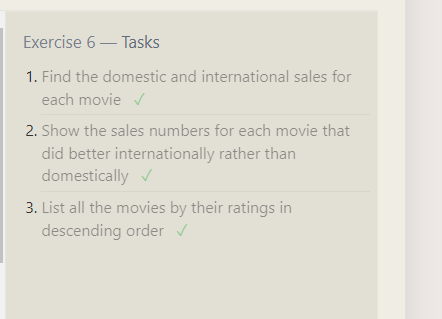
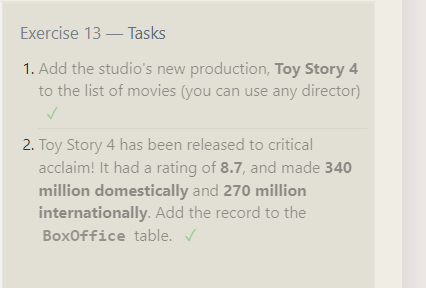
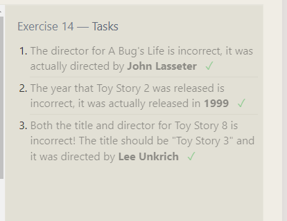
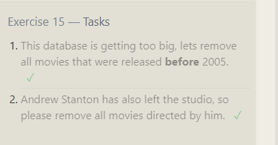
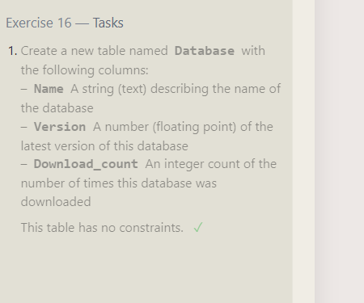
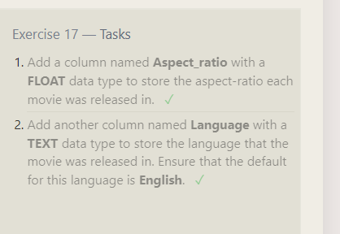
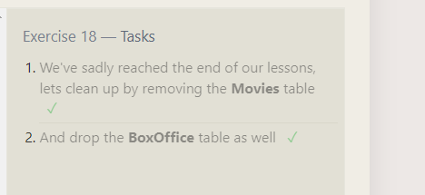
