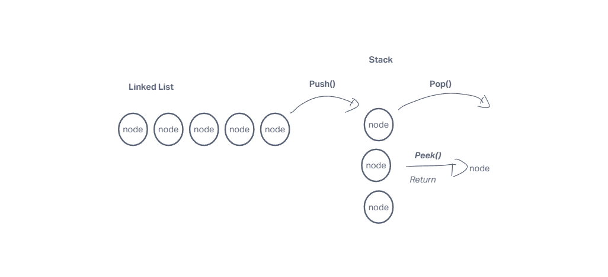
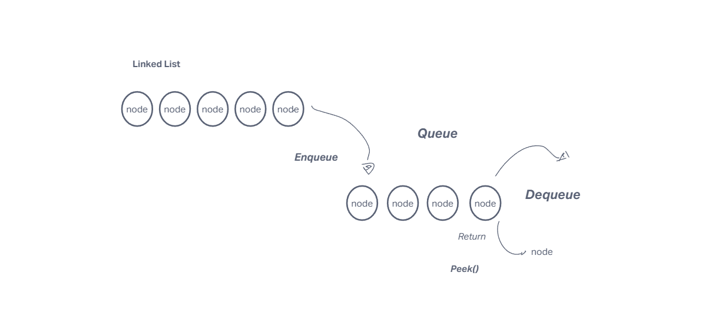

# Stacks and Queues

## Stack

- A stack is a first in last out data structure of nodes that do not reference the previous.  

- To put a node in to the stack Push() would be used to add the node to the stack. 
 
- Pop would be used to take the most recent item pushed top the strack off the top and will throw an error if the stack is empty.  

- Peek views the node in place(top).

- Top is the most recent node.  

## Queue

- A queue is a first in first out data structure of nodes that do not reference bthe previous.  

- enqueue adds nodes to queue in line style order(fifo).

- Dequeue is the removal of the first node in line.  

- Rear is the most recent node to bce put in the queue.  

- Peek views the value of the first node in the queue.  

